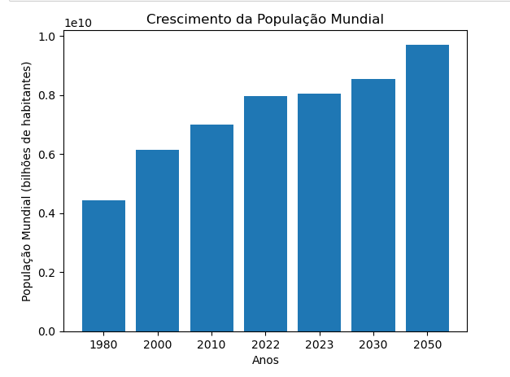

## World Population Data Analysis

This is a data analysis project using a 2023 countries by Population dataset available on Kaggle(https://www.kaggle.com/datasets/thabresh/2023-countries-by-population). This dataset was collected on ***April 20, 2023***.

The purpose of this analysis is to gain insights into the all statistics about the world population by countries data.

- Requirements

To run this project, you will need to have Python 3 installed on your computer, as well as some libraries like Pandas, Matplotlib and Seaborn. You can install them using pip with the following command:


```pip install pandas matplotlib seaborn```

### Instructions
To run this project, follow these steps:

- Download 2023 countries by population dataset from Kaggle (https://www.kaggle.com/datasets/thabresh/2023-countries-by-population) and extract the files to a folder on your computer.
- Open the "World_Population.ipynb" file in a Jupyter Notebook or Python development environment of your choice.
- Run notebook cells to load, clean and analyze data.


Dataset

- The dataset contains information about about 234 countries, including their population, density, densityMi, NetChange, growth rating, rating of most population country, area by country, and projection 2030 and 2050 population by country.

### Analysis
In this analysis, we explore the following questions:

- What are the 10 countries with the largest population ?

- What are the 10 countries with the largest density ?

- What are the 10 countries with the smallest density ?

- The population of Angola is growth? (The Angola is the 7th most growth in the world)

- The population of Ukraine is growth? (Ukraine is the first country that grew the least)

To answer these questions, we performed several exploratory data analyzes using charts, tables, and descriptive statistics.

### Results
Among the conclusions reached in this analysis, we highlight the following:

- India & China are the greast countries by population.

- During the research on the countries with the highest density of people per kilometer, it was possible to notice that smaller countries like Macau that have a large population tend to have a higher population density. Although, in the sample used, it is possible to see that the above statement is not always the most correct, since, during the study, Bangladesh appears with a large density, and with a relatively large area.

- During the analysis it was possible to verify that since 1980 the population of Ukraine has been gradually decreasing, although currently, the war is one of the main factors for the break in the population growth of that country.

- It was also possible to verify the rapid growth of Angola, a country belonging to sub-Saharan Africa, where it is possible to verify that that population grows 3% every year, which is equivalent to 1 million inhabitants per year.

- To my surprise, it is also possible to verify that Syria is the country that grows the most with 5%.  


### Conclusion
This 2023 countries by population data analysis project provided us with a lot of interesting information about the projections of world population growth, and especially for each country. It is important to emphasize that this information is related to the data set used and may vary over time, according to the respective data of each country. However, the analysis demonstrates the importance of data in understanding how and how fast the world's population is growing, as well as providing a solid foundation for future analysis and decision-making related to world population statistics.

Below are some of the graphs generated during the analysis:

_Bar World Population_


_Top 10 on Spotify_


_Top 10 on YouTube_


### Contribution
This project is open to contributions and improvements. If you want to contribute, you can fork this repository, create a branch with your changes, and submit a pull request for review.
